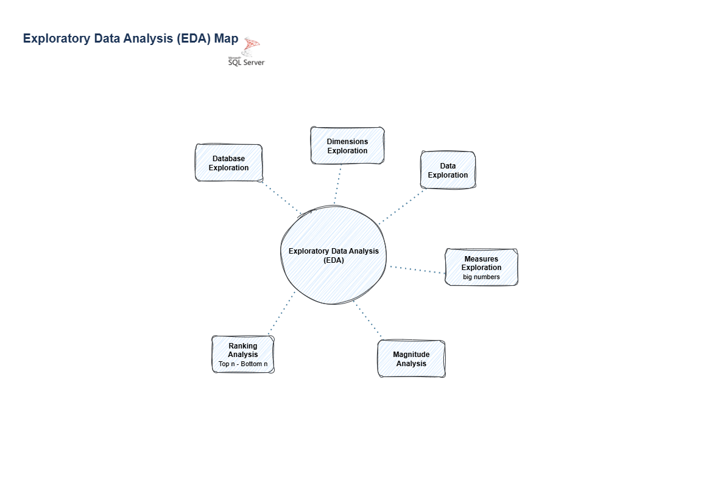

# 🔍 Exploratory Data Analysis (EDA) – Global Tourism Statistics

Welcome to the **Exploratory Data Analysis (EDA)** section of the **Global Tourism Statistics** project! 🧠  
This part of the repository focuses on analyzing the **Gold Layer** datasets to extract insights, validate data integrity, and prepare for reporting and visualization.  

The EDA was entirely developed in **T-SQL**, following a structured, repeatable, and documented workflow.  

---

## 🗺️ EDA Framework

The EDA process follows a systematic exploration approach, divided into key analytical areas:  



1. **Database Exploration** → Understanding the database structure and objects.  
2. **Dimensions Exploration** → Reviewing unique values and coverage for key dimensions.  
3. **Date Exploration** → Checking time span (1995–2022) and temporal consistency.  
4. **Measures Exploration** → Validating numerical measures and detecting anomalies.  
5. **Magnitude Analysis** → Comparing data magnitude by country, indicator, and year.  
6. **Ranking Analysis** → Identifying top-performing countries and indicators.

---

## 📊 Objectives

The goal of this analysis is to:  

- Validate the **completeness and quality** of the Gold layer.  
- Understand **temporal, dimensional, and numerical distributions**.  
- Detect **outliers, missing data, and irregularities**.  
- Support the creation of **dashboards and KPIs** for global tourism and SDG indicators.  

---

## 🧩 EDA Scripts

All EDA modules are written in **T-SQL** and fully documented.  
Each script can be executed independently, using dynamic parameters (`@FactViews`, `@Unit`, `@Year`, `@Country`, etc.).  

| Category | Description |
|----------|-------------|
| 🧱 Database Exploration | Lists all objects and columns to understand schema design. |
| 🌍 Dimensions Exploration | Retrieves distinct Countries, Indicators, Years, and Units to verify data coverage. |
| 📅 Date Exploration | Finds first and last year available; checks time range (1995–2022). |
| 📏 Measures Exploration | Calculates totals by unit of measure and flags invalid percentage values. |
| 📈 Magnitude Analysis | Compares total values by Indicator, Country, and Year to identify dominant contributors. |
| 🏆 Ranking Analysis | Produces Top-N/Bottom-N rankings by indicator, country, and year. |

---

## 🧠 Insights & Methodology

The EDA is designed to ensure that analytical outputs from the **Gold Layer** are both valid and meaningful.  

Key aspects validated include:
- ✅ Referential integrity (matching dimension keys).  
- ✅ Consistent units of measure across indicators.  
- ✅ No negative or unrealistic percentage values.  
- ✅ Uniform temporal coverage across fact tables.  
- ✅ Logical magnitude relationships between inbound, outbound, and domestic datasets.  

---

## 🧮 Example Findings

- **Year coverage** confirmed: 1995 → 2022.  
- **Units** standardized to `NUMBER`, `THOUSANDS`, and `US$ MILLIONS`.  
- **Outliers** identified in SDG and Industries facts where percentages >100%.  
- **Top tourism spenders** (US$ MILLIONS): USA, China, Germany.  
- **Longest stay averages** observed in European and island countries.  

---

## 🛠️ Tools & Environment

- **SQL Server (T-SQL)** — Analysis and validation queries.  
- **Draw.io** — EDA conceptual map (`docs/Eda_Map.png`).  
- **GitHub** — Repository management and documentation.  
- **Excel / Tableau (optional)** — Additional exploratory visualization.

---

## 📂 Repository Structure

```
global-tourism-eda/
│
├── datasets/ # Optional: CSV extracts or EDA samples
│
├── scripts/
│ └── eda/
│ ├── Eda - Database Exploration.sql
│ ├── Eda - Dimensions Exploration.sql
│ ├── Eda - Date Exploration.sql
│ ├── Eda - Measures Exploration.sql
│ ├── Eda - Magnitude Analysis.sql
│ └── Eda - Ranking.sql
│
├── docs/
│ ├── Eda Map.png
│ ├── types_of_tourism.md
│ ├── tourism_indicators_glossary_gold.md
│ └── ...
│
└── README_EDA.md
```

---

## 📈 Next Steps

- [ ] Conduct advanced KPI analysis in SQL Server on Global Tourism datasets.  
- [ ] Build Tableau dashboards to visualize key tourism trends and indicators.  

---

## 🧾 License

This EDA documentation is part of the **Global Tourism Data** project and released under the **MIT License**.  

---

## 🌟 About Me

Hi, I’m **Daniele Amoroso** 👋  
HR Generalist transitioning into **Data Analytics and Data Science**, with a focus on SQL, Python, and AI Automation.

Currently transitioning into the data field by building portfolio projects that combine technical skills with analytical thinking.

Connect: [LinkedIn – Daniele Amoroso](https://www.linkedin.com/in/daniele-a-080786b7/)

